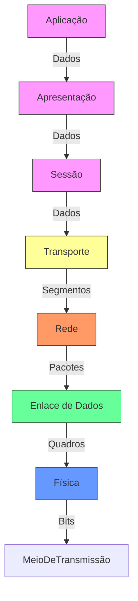

# Redes de Computadores 🛜

Disciplina ministrada pelo professor Claudio Souza Nunes

Lattes: http://lattes.cnpq.br/7682775885207598

## Aula 01

### Importância das Redes de Computadores

- Comunição entre pessoas
- Compartilhar recursos e troca de informações
- Parte essencial de nossa infraestrutura
- Aplicação em todos os setores
- Presença em todos os lugares

### Modelos de Rede

| Característica                     | LAN (Local Area Network)                                                                 | WAN (Wide Area Network)                                                                 | MAN (Metropolitan Area Network)                                                                 | PAN (Personal Area Network)                                                                 |
|-------------------------------------|------------------------------------------------------------------------------------------|-----------------------------------------------------------------------------------------|-------------------------------------------------------------------------------------------------|---------------------------------------------------------------------------------------------|
| Abrangência                         | Abrange menores distâncias (dentro de um prédio)                                         | Abrange maiores distâncias. Pode interconectar redes locais                             | Abrange uma cidade ou um campus universitário                                                   | Abrange distâncias muito curtas (geralmente até 10m)                                        |
| Velocidade dos Links de Comunicação | Mais rápidos                                                                            | Mais lentos                                                                            | Velocidade intermediária entre LAN e WAN                                                        | Mais lentos (geralmente)                                                                    |
| Objetivo Principal                  | Compartilhamento de recursos (impressoras, arquivos)                                     | Compartilhamento de informações entre grandes distâncias                                | Compartilhamento de recursos e informações em uma área metropolitana                            | Interligação de periféricos de uso pessoal (teclados, mouses)                               |
| Tipo de Topologia                   | Peer-to-peer ou servidores dedicados                                                     | Peer-to-peer                                                                           | Peer-to-peer ou servidores dedicados                                                            | Peer-to-peer                                                                                |
| Gestão das Informações              | Centralizadas                                                                           | Distribuídas                                                                           | Mista (pode ser centralizada ou distribuída)                                                    | Compartilhadas                                                                              |
| Exemplo de Uso                      | Redes empresariais ou domésticas                                                         | Internet                                                                               | Redes de grandes universidades ou empresas                                                      | Conexões Bluetooth, Wi-Fi entre dispositivos pessoais                                       |
| Custos de Implementação e Manutenção | Relativamente baixos                                                                    | Altos                                                                                  | Intermediários                                                                                  | Muito baixos                                                                                |
| Confiabilidade e Segurança          | Alta (em redes bem configuradas)                                                         | Variável (dependendo da infraestrutura)                                                | Alta (em redes bem configuradas)                                                                | Baixa (vulnerável a interferências e ataques próximos)                                       |
| Escalabilidade                      | Limitada                                                                                | Alta                                                                                   | Moderada                                                                                        | Muito limitada                                                                              |

### Modelo ISO/OSI
- É um modelo conceitual que padroniza as funções de um sistema em sete camadas distintas, sendo cada uma delas responsável por uma parte específica do processo de comunicação, facilitando a compreensão e o desenvolvimento de protocolos e tecnologias de rede. Garante que diferentes sistemas e redes possom se comunicar de forma eficiente e eficaz.

- Cada camada pega as informações passadas pela camada superior, acrescenta as informações pela qual ele é responsável e passa os dados para a camada inferior

* Mesma máquina -> camadas adjacentes
* Máquinas diferentes -> camadas correspondentes

| Camada         | Função Simplificada                                      | Exemplos de Serviços/Protocolos       | Exemplo Prático                     |
|----------------|---------------------------------------------------------|---------------------------------------|-------------------------------------|
| **Física**     | Transmite bits brutos (0s e 1s) por cabos, ondas, etc.  | Ethernet, USB, Bluetooth              | Conectar um cabo de rede ao PC       |
| **Enlace**     | Organiza os bits em "quadros" e controla erros locais   | Switches, Wi-Fi, Ethernet             | Switch ligando computadores numa LAN |
| **Rede**       | Define rotas e endereços lógicos (como um CEP)          | Roteadores, IP                        | Roteador enviando dados para outro país |
| **Transporte** | Garante entrega correta (como um correio confiável)     | TCP (confiável), UDP (rápido)         | Carregar um site sem erros           |
| **Sessão**     | Controla "conversas" entre apps (abre/fecha conexões)   | RPC, PAP                              | Manter login ativo no Netflix        |
| **Apresentação**| Traduz dados (criptografia, compressão, formatos)      | SSL/TLS, JPEG, MPEG                   | Cadeado no navegador (HTTPS)         |
| **Aplicação**  | Apps que você usa diretamente (navegador, e-mail, etc.) | HTTP, FTP, SMTP                       | Abrir o Gmail ou Facebook            |

### Topologia de rede
- É a disposição física ou lógica dos elementos (nós) em uma rede de comunicação. Ela define como os diferentes dispositivos estão interconectados e como os dados fluem entre esses dispositivos. As topologias de rede podem ser classificadas de rede podem ser classificadas de várias maneiras, incluindo **física** *(baseada na disposição real dos cabos e hardware)* e **lógica** *(baseada na forma como os dados são transferidos na rede, independentemente da disposição física)*

| Topologia | Descrição | Vantagens | Desvantagens |
|-----------|-----------|-----------|--------------|
| **Estrela** | Todos os dispositivos estão conectados a um dispositivo central (como um switch ou hub). | - Fácil de instalar e gerenciar - Problemas em um cabo não afetam o restante da rede | - Dependência do dispositivo central - Pode ser caro devido ao custo do hardware |
| **Barramento** | Todos os dispositivos estão conectados a um único cabo central (barramento). | - Econômica - Fácil de instalar para pequenas redes | - Difícil de diagnosticar problemas - Performance degrada com o aumento de dispositivos e tráfego |
| **Anel** | Cada dispositivo tem duas conexões, uma para cada dispositivo adjacente, formando um anel. | - Performance previsível - Sem colisões de dados | - Problemas em um dispositivo ou cabo afetam toda a rede - Difícil de expandir |
| **Malha** | Cada dispositivo está conectado a todos os outros dispositivos. | - Alta redundância e confiabilidade - Falhas não afetam a rede como um todo | - Complexa e cara para instalar e manter - Grande quantidade de cabos necessária |
| **Árvore** | Topologia hierárquica que combina características da estrela e do barramento com sub-redes organizadas em uma estrutura de árvore. | - Fácil de gerenciar e expandir - Problemas em uma sub-rede não afetam o resto da rede | - Dependência dos nós superiores - Pode ser difícil de configurar inicialmente |
| **Híbrida** | Combinação de duas ou mais topologias diferentes, adaptando-se às necessidades específicas da rede. | - Flexível e escalável - Pode otimizar as vantagens de diferentes topologias | - Pode ser complexa de configurar e gerenciar - Custo pode variar dependendo das topologias usadas |
