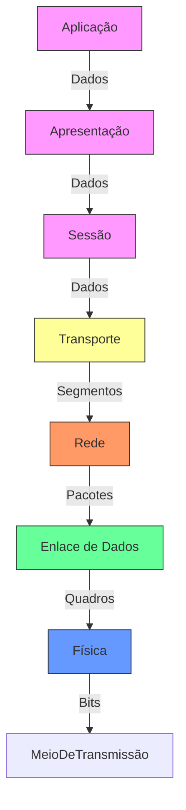
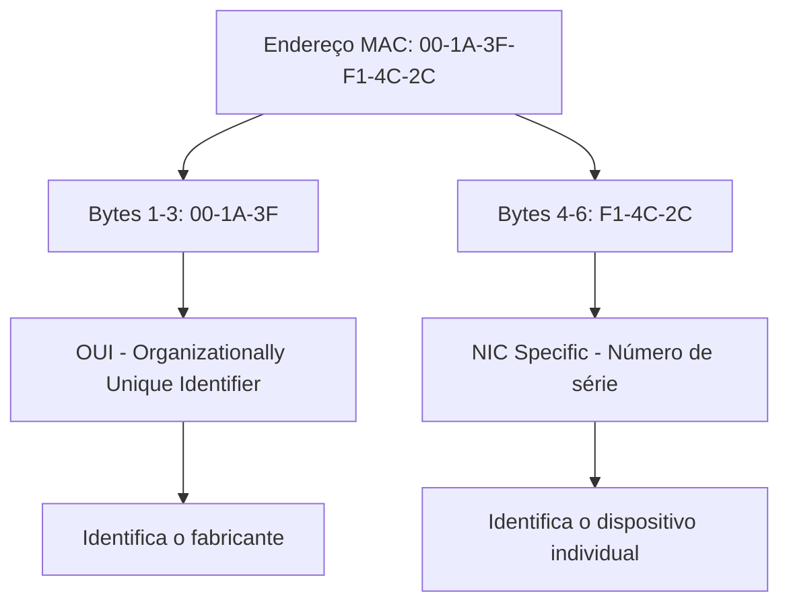
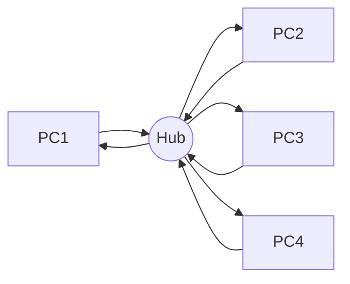
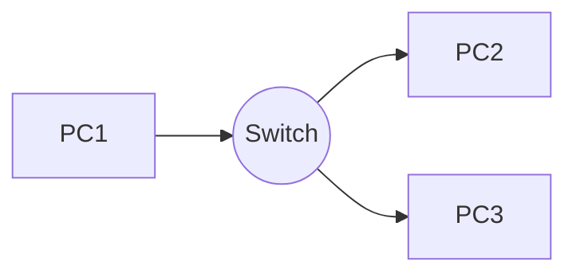
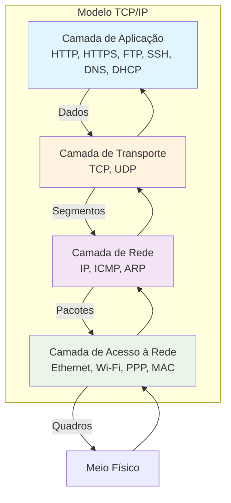

# Redes de Computadores 🛜

Disciplina ministrada pelo professor Claudio Souza Nunes

Lattes: http://lattes.cnpq.br/7682775885207598

## Aula 01 - Introdução, Classificação, Modelo de Referência ISO x OSI

### Importância das Redes de Computadores

- Comunição entre pessoas
- Compartilhar recursos e troca de informações
- Parte essencial de nossa infraestrutura
- Aplicação em todos os setores
- Presença em todos os lugares

### Modelos de Rede

| Característica                     | LAN (Local Area Network)                                                                 | WAN (Wide Area Network)                                                                 | MAN (Metropolitan Area Network)                                                                 | PAN (Personal Area Network)                                                                 |
|-------------------------------------|------------------------------------------------------------------------------------------|-----------------------------------------------------------------------------------------|-------------------------------------------------------------------------------------------------|---------------------------------------------------------------------------------------------|
| Abrangência                         | Abrange menores distâncias (dentro de um prédio)                                         | Abrange maiores distâncias. Pode interconectar redes locais                             | Abrange uma cidade ou um campus universitário                                                   | Abrange distâncias muito curtas (geralmente até 10m)                                        |
| Velocidade dos Links de Comunicação | Mais rápidos                                                                            | Mais lentos                                                                            | Velocidade intermediária entre LAN e WAN                                                        | Mais lentos (geralmente)                                                                    |
| Objetivo Principal                  | Compartilhamento de recursos (impressoras, arquivos)                                     | Compartilhamento de informações entre grandes distâncias                                | Compartilhamento de recursos e informações em uma área metropolitana                            | Interligação de periféricos de uso pessoal (teclados, mouses)                               |
| Tipo de Topologia                   | Peer-to-peer ou servidores dedicados                                                     | Peer-to-peer                                                                           | Peer-to-peer ou servidores dedicados                                                            | Peer-to-peer                                                                                |
| Gestão das Informações              | Centralizadas                                                                           | Distribuídas                                                                           | Mista (pode ser centralizada ou distribuída)                                                    | Compartilhadas                                                                              |
| Exemplo de Uso                      | Redes empresariais ou domésticas                                                         | Internet                                                                               | Redes de grandes universidades ou empresas                                                      | Conexões Bluetooth, Wi-Fi entre dispositivos pessoais                                       |
| Custos de Implementação e Manutenção | Relativamente baixos                                                                    | Altos                                                                                  | Intermediários                                                                                  | Muito baixos                                                                                |
| Confiabilidade e Segurança          | Alta (em redes bem configuradas)                                                         | Variável (dependendo da infraestrutura)                                                | Alta (em redes bem configuradas)                                                                | Baixa (vulnerável a interferências e ataques próximos)                                       |
| Escalabilidade                      | Limitada                                                                                | Alta                                                                                   | Moderada                                                                                        | Muito limitada                                                                              |

### Modelo ISO/OSI
- É um modelo conceitual que padroniza as funções de um sistema em sete camadas distintas, sendo cada uma delas responsável por uma parte específica do processo de comunicação, facilitando a compreensão e o desenvolvimento de protocolos e tecnologias de rede. Garante que diferentes sistemas e redes possam se comunicar de forma eficiente e eficaz.

- Cada camada pega as informações passadas pela camada superior, acrescenta as informações pela qual ele é responsável e passa os dados para a camada inferior

* Mesma máquina -> camadas adjacentes
* Máquinas diferentes -> camadas correspondentes

| Camada         | Função Simplificada                                      | Exemplos de Serviços/Protocolos       | Exemplo Prático                     |
|----------------|---------------------------------------------------------|---------------------------------------|-------------------------------------|
| **Física**     | Transmite bits brutos (0s e 1s) por cabos, ondas, etc.  | Ethernet, USB, Bluetooth              | Conectar um cabo de rede ao PC       |
| **Enlace**     | Organiza os bits em "quadros" e controla erros locais   | Switches, Wi-Fi, Ethernet             | Switch ligando computadores numa LAN |
| **Rede**       | Define rotas e endereços lógicos (como um CEP)          | Roteadores, IP                        | Roteador enviando dados para outro país |
| **Transporte** | Garante entrega correta (como um correio confiável)     | TCP (confiável), UDP (rápido)         | Carregar um site sem erros           |
| **Sessão**     | Controla "conversas" entre apps (abre/fecha conexões)   | RPC, PAP                              | Manter login ativo no Netflix        |
| **Apresentação**| Traduz dados (criptografia, compressão, formatos)      | SSL/TLS, JPEG, MPEG                   | Cadeado no navegador (HTTPS)         |
| **Aplicação**  | Apps que você usa diretamente (navegador, e-mail, etc.) | HTTP, FTP, SMTP                       | Abrir o Gmail ou Facebook            |

### Topologia de rede
- É a disposição física ou lógica dos elementos (nós) em uma rede de comunicação. Ela define como os diferentes dispositivos estão interconectados e como os dados fluem entre esses dispositivos. As topologias de rede podem ser classificadas de rede podem ser classificadas de várias maneiras, incluindo **física** *(baseada na disposição real dos cabos e hardware)* e **lógica** *(baseada na forma como os dados são transferidos na rede, independentemente da disposição física)*

| Topologia | Descrição | Vantagens | Desvantagens |
|-----------|-----------|-----------|--------------|
| **Estrela** | Todos os dispositivos estão conectados a um dispositivo central (como um switch ou hub). | - Fácil de instalar e gerenciar - Problemas em um cabo não afetam o restante da rede | - Dependência do dispositivo central - Pode ser caro devido ao custo do hardware |
| **Barramento** | Todos os dispositivos estão conectados a um único cabo central (barramento). | - Econômica - Fácil de instalar para pequenas redes | - Difícil de diagnosticar problemas - Performance degrada com o aumento de dispositivos e tráfego |
| **Anel** | Cada dispositivo tem duas conexões, uma para cada dispositivo adjacente, formando um anel. | - Performance previsível - Sem colisões de dados | - Problemas em um dispositivo ou cabo afetam toda a rede - Difícil de expandir |
| **Malha** | Cada dispositivo está conectado a todos os outros dispositivos. | - Alta redundância e confiabilidade - Falhas não afetam a rede como um todo | - Complexa e cara para instalar e manter - Grande quantidade de cabos necessária |
| **Árvore** | Topologia hierárquica que combina características da estrela e do barramento com sub-redes organizadas em uma estrutura de árvore. | - Fácil de gerenciar e expandir - Problemas em uma sub-rede não afetam o resto da rede | - Dependência dos nós superiores - Pode ser difícil de configurar inicialmente |
| **Híbrida** | Combinação de duas ou mais topologias diferentes, adaptando-se às necessidades específicas da rede. | - Flexível e escalável - Pode otimizar as vantagens de diferentes topologias | - Pode ser complexa de configurar e gerenciar - Custo pode variar dependendo das topologias usadas |

## Aula 02 - Meios físicos de Transmissão - Conectividade Elétrica e Ótica

### Definição
- Constituem a base da camada física do modelo ISO/OSI, são responsável pela transmissão de sinais elétricos ou ópticos que transportam os dados brutos entre os dispositivos conectados à rede. A escolha do meio físico adequado influencia diretamente a qualidade da comunicação, a velocidade de transmissão e a confiabilidade da rede.

### Classificação dos Meios Físicos de Transmissão

#### Elétricos
- Transmitem sinais na forma de pulsos elétricos
- Sujeitos a interferências eletromagnéticas, mas são amplamente utilizados devido ao seu custo acessível e à facilidade de instalação
- ex: Cabo coaxical e o cabo par trançado

#### Ópticos
- A fibra óptica transmite dados na forma de pulso de luz
-  Largura de banda muito maior e menor atenuação de sinal ao longo de longas distâncias
-  Ideal para conexão de alta velocidade e longas distâncias

### Cabo Coaxial

#### Estrutura
- Núcleo condutor central (geralmente de cobre)
- Camada de isolamento
- Malha de blindagem externa (proteção contra interferências eletromagnéticas)
- Capa de revestimento externo

#### Tipos

- Thicknet (10BASE5): Usado em backbones de redes antigas, com alta resistência a interferências e capacidade de transmissão em longas distâncias
- Thinnet (10BASE2): Mais finos e flexível que o Thicknet, facilitando a instalação em redes menores.

#### Conectores
- BNC: Mais comum, usado tanto em Thicknet quanto em Thinnet
- TNC e F-type: Conectores usados em aplicações específicas, como conexões de antenas.

#### Vantagens
- Baixo custo 
- Forte resistência à interferência
- Alta largura de banda
- Resistência física

#### Desvantagens
- Díficil de manusear
- Velocidade de transmissão limitada comparada com novas tecnologias

### Cabo Par Trançado

#### Estrutura
- Pares de fios de cobre trançados entre si (reduz a interferência eletromagnética e o crosstalk entre os pares).

#### Tipos
- UTP (Unshield Twisted Pair): Não possui blindagem, sendo mais barato e mais fácil de instalar, porém menos protegido contra interferências.
- STP (Shielded Twisted Pair): Inclui uma blindagem adicional que melhora a proteção contra interferência, sendo usado em ambientes com alta interferência eltromagnética.

#### Categorias

| Categoria | Velocidade Máxima | Uso Principal                          | Onde é Usado?                     |
|-----------|-------------------|----------------------------------------|-----------------------------------|
| **Cat 1** | 1 Mbps            | Voz (telefonia)                        | Linhas telefônicas antigas        |
| **Cat 2** | 4 Mbps            | Redes antigas (Token Ring)             | Sistemas obsoletos                |
| **Cat 3** | 10 Mbps           | Ethernet básica (10BASE-T)             | Redes antigas, telefonia          |
| **Cat 4** | 16 Mbps           | Redes Token Ring                       | Sistemas dos anos 90              |
| **Cat 5** | 100 Mbps          | Ethernet padrão (100BASE-TX)           | Redes domésticas/escritórios      |
| **Cat 5e**| 1 Gbps            | Ethernet Gigabit (1000BASE-T)          | Redes atuais (casas/empresas)     |
| **Cat 6** | 1 Gbps (10 Gbps*) | Ethernet Gigabit com menos interferência | Redes exigentes, cabos longos     |
| **Cat 6a**| 10 Gbps           | Ethernet 10 Gbps                       | Data centers, redes corporativas  |
| **Cat 7** | 10 Gbps           | Alta velocidade com blindagem          | Ambientes com muita interferência |
| **Cat 7a**| 10 Gbps           | Ultra velocidade (40 Gbps até 50m)     | Aplicações profissionais          |
| **Cat 8** | 40 Gbps           | Data centers de última geração         | Conexões curtas (até 30m)         |

> *Cat 6 suporta 10 Gbps até 55 metros.  
**Dica:** Para casas/escritórios, **Cat 5e** ou **Cat 6** são suficientes.  
**Profissional?** **Cat 6a+** para data centers ou redes 10G+.

#### Conectores
- RJ-45: Padrão em todas as categorias de UTP, compatível com a maioria sas aplicações de rede.
- GG45 e TERA: Usados em categorias superiores, como Cat7 e Cat8, para suportar maiores frequências e velocidades.

  
#### Vantagens e Desvantagens

| Aspecto              | Vantagens                                      | Desvantagens                                      |
|----------------------|-----------------------------------------------|--------------------------------------------------|
| **Custo**           | Mais barato que fibra óptica                 | Mais caro que soluções wireless em pequenas instalações |
| **Instalação**      | Fácil instalação e manuseio                 | Limitação de distância (sinal degrada com comprimento) |
| **Flexibilidade**   | Versátil para redes locais                  | Menos flexível para upgrades futuros vs fibra óptica |
| **Velocidade**      | Até 40 Gbps (Cat 8)                         | Inferior à fibra óptica                          |
| **Largura de Banda**| Suficiente para redes locais padrão         | Limitada vs fibra óptica                         |
| **Interferência**   | Blindados (STP) resistem a interferências   | Não blindados (UTP) são suscetíveis a ruídos     |
| **Durabilidade**    | Boa para ambientes internos                 | Menos resistente a danos físicos vs fibra        |
| **Compatibilidade** | Compatível com maioria dos equipamentos     | Pode exigir upgrades para categorias superiores  |
| **Manutenção**      | Fácil reparo                                | Desgaste natural (oxidação, conectores)          |
| **Distância**       | Ideal até 100m                              | Acima de 100m requer repetidores/switches        |

### Fibras Óticas

- A fibra óptica utiliza pulsos de luz para transmitir dados através de um núcleo de vidro ou plástico. Este núcleo é cercado por uma camada de revestimento que reflete a luz internamente, permitindo que os sinais de luz viajem longas distâncias com mínima perda de sinal

#### Tipos

##### Monomodo x Multimodo

| Aspecto                 | Fibra Óptica Monomodo                          | Fibra Óptica Multimodo                        |
|-------------------------|-----------------------------------------------|-----------------------------------------------|
| **Distância**           | Até 100 km (sem repetidor)                   | Até 2 km (sem repetidor)                     |
| **Largura de Banda**    | Alta (ideal para altas taxas de dados)       | Limitada (comparada à monomodo)              |
| **Custo**               | Alto (fibra + equipamentos laser)           | Econômico (fibra + transceptores VCSEL/LED)  |
| **Diâmetro do Núcleo**  | 9 µm (fino, menos dispersão)                | 50 µm ou 62.5 µm (maior dispersão modal)     |
| **Fonte de Luz**        | Laser (preciso e caro)                      | LED/VCSEL (mais barato)                      |
| **Aplicações**          | Telecomunicações, backbones de longa distância | LANs, data centers, sistemas locais         |
| **Instalação**          | Complexa (exige alta precisão)              | Fácil (núcleo largo tolera desalinhamentos) |
| **Desempenho**          | Superior (baixa atenuação, alta velocidade) | Adequado para curtas distâncias             |
| **Durabilidade**        | Alta (ambientes externos/longa distância)   | Boa (para ambientes internos/curtas distâncias) |
| **Upgrades Futuros**    | Flexível (suporta aumentos de capacidade)   | Limitado (restrições de largura de banda)    |

##### Conectores

| Conector | Descrição Resumida | Aplicações Principais |
|----------|--------------------|-----------------------|
| **SC**   | Conector push-pull de 2,5 mm, fácil manuseio | Data centers, telecomunicações |
| **LC**   | Compacto (ferrule 1,25 mm), alta densidade | Redes densas, data centers |
| **ST**   | Conector de bayoneta (2,5 mm), antigo | Redes multimodo antigas |
| **FC**   | Com rosca, robusto | Telecomunicações de longa distância |
| **SMA**  | Rosca antiga, industrial | Aplicações militares/industriais |
| **E2000**| Tampa automática | Redes de alta performance |
| **M**    | Multifibras (alta densidade) | Data centers, telecom |
| **DN**   | Rosca redonda, estável | Redes robustas |
| **MT-RJ**| Compacto (2 fibras, estilo RJ45) | Alta densidade |
| **MPO**  | Multifibras (12-72 fibras) | Data centers, 40G/100G |
| **D4**   | Com rosca (2 mm), obsoleto | Redes antigas |
| **Biconic** | Cônico, histórico | Sistemas antigos |

##### Vantagens x Desvantagens
| Vantagens                          | Desvantagens                          |
|------------------------------------|---------------------------------------|
| ✅ Alta largura de banda (100Gbps+) | ❌ Alto custo inicial                 |
| ✅ Longas distâncias (100km+)       | ❌ Fragilidade física                 |
| ✅ Imunidade a interferências       | ❌ Reparos complexos                  |
| ✅ Alta segurança                   | ❌ Requer conversores óptico-elétricos|
| ✅ Sustentável (baixo consumo)      | ❌ Impacto ambiental na fabricação    |

### Resumo Geral 

| Aspecto                | Fibra Óptica                     | Par Trançado                     | Cabo Coaxial                     |
|------------------------|----------------------------------|----------------------------------|----------------------------------|
| **Custo**             | Alto (instalação + equipamentos) | Baixo                            | Moderado                         |
| **Largura de Banda**  | Centenas de Gbps                 | Até 10 Gbps (Cat6a/7)           | Até 10 Gbps (curtas distâncias)  |
| **Distância**         | Até 100 km                       | Até 100m (Cat6)                  | Até 500m                         |
| **Interferência**     | Imune                            | Suscetível (exceto STP)          | Boa resistência                  |
| **Segurança**         | Alta (dificil de interceptar)    | Baixa                            | Moderada                         |
| **Instalação**        | Complexa (cuidado com fragilidade)| Fácil                            | Moderadamente difícil            |
| **Manutenção**        | Caro (equipamentos especializados)| Barato                          | Moderado                         |
| **Aplicações**        | WANs, data centers               | LANs, telefonia                  | TV cabo, redes locais            |
| **Durabilidade**      | Alta (exceto flexões)            | Moderada                         | Alta                             |

| Necessidade               | Melhor Opção          | Por quê?                          |
|---------------------------|-----------------------|-----------------------------------|
| Orçamento limitado        | Par Trançado          | Custo baixo, fácil instalação     |
| Alta velocidade/longas distâncias | Fibra Óptica   | Largura de banda e alcance        |
| Resistência a interferência | Cabo Coaxial       | Blindagem eficiente               |
| Upgrades futuros          | Fibra Óptica          | Escalabilidade sem troca de cabos |

## Aula 03 - Equipamentos da Camada de Enlace (Ethernet)

#### 📜 Histórico do Ethernet
- **1973** → Criado por Robert Metcalfe (Xerox PARC)  
- **1976** → Primeiro artigo publicado  
- **1980** → Padrão DIX (Digital, Intel, Xerox)  
- **1983** → Padronização **IEEE 802.3**  
- Ethernet tornou-se o **padrão global para redes locais (LANs)**  

---

#### ⚙️ Funcionamento Básico
- Atua na **Camada 2 do Modelo OSI**  
- Identificação por **endereços MAC**
- **Quadros de Ethernet:**
-  Preamble, Destino MAC, Origem MAC, Tipo/Length, Dados, FCS.
- Tipos de transmissão:  
  - **Half-duplex** → um de cada vez  
  - **Full-duplex** → transmissão bidirecional simultânea  

---
#### MAC (Media Acess Control Address)

#### Unicast, Broadcast e Multicast

| Unicast | Broadcast | Multicast |
|----------|--------------------|-----------------------|
| Um único dispositico da rede   | Todos os dispositivos na rede | Um grupo de dispositivos na mesma rede

#### 🔄 CSMA/CD (Protocolo de Acesso ao Meio)
- **Carrier Sense** → verifica se o meio está livre  
- **Multiple Access** → vários dispositivos compartilham o meio  
- **Collision Detection** → detecta colisões e retransmite  

> 🚫 Em redes modernas não é mais necessário, pois os **switches** eliminam colisões. 

---

#### 📦 Hub x Switch

| Característica       | Hub (Legado) ⚠️ | Switch (Atual) ✅ |
|----------------------|----------------|------------------|
| **Camada OSI**       | Física (1)     | Enlace (2)       |
| **Transmissão**      | Replica para todas as portas | Encaminha apenas ao destino |
| **Colisões**         | Frequentes     | Eliminadas       |
| **Desempenho**       | Baixo (meio compartilhado) | Alto (porta dedicada) |
| **Inteligência**     | Nenhuma        | Tabela MAC para decisão |

---

#### 📊 Funcionamento

##### 🔹 Hub

➡ Envia para **todas** as portas → gera colisões.
##### 🔹 Switch

➡ Encaminha o quadro **apenas para o destino correto**.

---

#### 🧰 Modos de Operação dos Switches
- **Flooding** → envia para todas as portas quando não conhece o destino  
- **Forwarding** → envia apenas para a porta correta  
- **Blocking** → descarta pacotes não permitidos  
- **Aging** → remove entradas antigas da tabela MAC  

---

#### Tipos de Switches 
- **Store-and-forward**: Lê todo o pacote, armazena em buffer, testa integridade e envia se ok.
- **Cut-through**: Verifica endereços e envia (sem verificação de integridade).

#### Tipos de Ligação
- **Cascateamento:** São usados portas "normais" do switch conectadas através de um cabo *cross over*
- **Empilhamento:** Os equipamentos são ligados usando portas criadas especialmente para este fim.

#### 🚀 Evolução das Velocidades Ethernet
| Padrão       | Velocidade | Cabo                     |
|--------------|------------|--------------------------|
| **10BASE-T** | 10 Mbps    | Par trançado Cat 3       |
| **100BASE-TX** | 100 Mbps | Par trançado Cat 5       |
| **1000BASE-T** | 1 Gbps   | Par trançado Cat 5e ou + |
| **10GBASE-T** | 10 Gbps   | Par trançado Cat 6a ou + |

----

#### ✅ Vantagens do Ethernet
- Fácil implementação e configuração  
- Topologias flexíveis  
- Custo acessível  
- Evolução contínua para **altas velocidades**  

---

#### Sinalização

| Método de Sinalização                           | Descrição                                                                                                                                   | Tipo de Ethernet                              | Velocidade        | Comentários                                                                                                                                                       |
|-------------------------------------------------|---------------------------------------------------------------------------------------------------------------------------------------------|-----------------------------------------------|------------------|-------------------------------------------------------------------------------------------------------------------------------------------------------------------|
| **Codificação Manchester**                      | Cada bit de dados é representado por uma transição no meio do intervalo de bit. Proporciona sincronização, pois cada bit garante uma transição de sinal. | 10BASE-T, 10BASE5, 10BASE2                    | 10 Mbps          | Utilizado nas primeiras versões de Ethernet, onde a simplicidade era a prioridade. Introduz overhead de 100% (1 bit de controle para cada bit de dados).          |
| **Codificação 4B/5B**                           | Converte cada grupo de 4 bits de dados em um grupo de 5 bits codificados. Os 5 bits codificados são então transmitidos usando NRZI (Non-Return-to-Zero Inverted). | 100BASE-TX, 100BASE-FX                        | 100 Mbps         | O código 4B/5B ajuda a garantir a sincronização e evitar sequências longas de bits 0 ou 1. Uma perda temporária da recuperação do sinal tem overhead de 25%.      |
| **Codificação 8B/10B**                          | Converte cada grupo de 8 bits de dados em um grupo de 10 bits codificados. Garante a densidade mínima de transições para manter a sincronização de relógio. | 1000BASE-X                                    | 1 Gbps           | Usado em Gigabit Ethernet para manter a integridade dos dados durante a transmissão em alta velocidade. Introduz um overhead de 25%.                              |
| **Codificação PAM-5**                           | Modulação em Amplitude de Pulso com 5 níveis diferentes. Cada símbolo transmite 2 bits de dados com três níveis adicionais de redundância.   | 1000BASE-T                                    | 1 Gbps           | Utilizado para permitir a transmissão de Gigabit Ethernet sobre cabos de par trançado (Cat 5e). É uma evolução da transmissão maior em relação à NRZI.            |
| **Codificação NRZ (Non-Return-to-Zero)**        | Simula “1” com uma alta tensão e “0” com baixa tensão. Sem transição de sinal, a menos que mude de 1 para 0 ou vice-versa.                   | 10BASE-T, 100BASE-TX                          | 10/100 Mbps      | Simples, mas propensa a problemas de sincronização quando há longas sequências de bits iguais. Usado em variantes menos comuns do Fast Ethernet.                  |
| **Codificação NRZI (Non-Return-to-Zero Inverted)** | Representa cada “1” como uma transição de nível e mantém o nível para “0”. Cada transição indica um bit de “1”, mas inverte o sinal quando o bit é “0”. | 100BASE-FX                                    | 100 Mbps         | Ajuda a manter a sincronização de relógio em comparação com NRZ puro.                                                                                             |
| **Codificação PAM-16 (PAM 4 para 25G/50G/100G Ethernet)** | Modulação em Amplitude de Pulso com 4 ou 16 níveis diferentes, transmitindo múltiplos bits por símbolo.                                      | 25GBASE-T, 50GBASE-T, 100GBASE-T              | 25 Gbps, 50 Gbps, 100 Gbps | Utilizado em Ethernet de alta velocidade, melhora a eficiência do espectro, mas requer tecnologias mais avançadas de mitigação de ruído e correção de erro.       |

## Aula 04 - Protocolos IP e ARP

### Protocolo IP
- É um dos principais pilares do conjunto de protocolos TCP/IP que forma a base da comunicação na internet e em redes locais.
- O **IPv4** é responsável por endereçar dispositivos em uma rede, permitindo que dados sejam enviados e recebidos entre eles, permitiu a expansão massiva da internet, criando um sistema estruturado de endereçamento que facilitou o crescimento das redes de computadores. A principal função do IPv4 é fornecer endereços únicos a cada dispositivo conectado à rede, permitindo que a comunicação ocorra de forma organizada e eficiente.

### Modelo TCP/IP

### Encapsulamento

**Camada de Aplicação:**

- Os dados originais (mensagem) são criados pelo aplicativo

- Exemplo: requisição HTTP, email, etc.

**Camada de Transporte (TCP/UDP):**

- Recebe os dados da aplicação

- Adiciona um cabeçalho TCP ou UDP criando um segmento

- O cabeçalho contém informações de porta, sequência, checksum

**Camada de Rede (IP):**

- Recebe o segmento TCP/UDP

- Adiciona um cabeçalho IP criando um pacote ou datagrama

- O cabeçalho IP contém endereços IP de origem e destino

**Camada de Enlace de Dados (Ethernet):**

- Recebe o pacote IP

- Adiciona um cabeçalho e rodapé Ethernet criando um quadro

- O cabeçalho contém endereços MAC físicos

- Usa ARP para descobrir o endereço MAC do destinatário

**Camada Física:**

- Converte o quadro em sinais elétricos, ópticos ou electromagnéticos

- Transmite os bits através do meio físico (cabos, wireless)

### Desencapsulamento:
No destino, o processo ocorre inversamente - cada camada remove seu cabeçalho específico e encaminha os dados para a camada superior, até que a mensagem original seja entregue à aplicação.

### Estrutura do Pacote IP

| Componente   | Tamanho    | Explicação                  |
|--------------|------------|-----------------------------|
| **Versão**   | 4 bits     | Indica a versão do protocolo|
| **IHL - Internet Header Length** | 4 bits | Especifica o tamanho do cabeçalho em múltilos de 4 bytes |
| **Type of Service (ToS)** | 8 bits   | Define a prioridade do pacote e a qualidade de serviço desejada, indicando, por exemplo, se o pacote deve ter baixa latência ou alta confiabilidade |
| **Total Length** | 16 bits | Especifica o tamanho total do pacote, incluindo cabeçalho e dados, em bytes. O tamanho máximo é 65.535 bytes |
| **Identification** | 16 bits | Usado para identificar fragmentos de um pacote. Se um pacote for fragmentos de um pacote. Se um pacote for fragmentado terão o mesmo valor de identificação |
| **Flags** | 3 bits | Contém três bandeiras (flags) usadas para controlar a fragmentação. Os principais são: **DF (Don't Fragment)**: Indica que o pacote não deve ser fragmentado. **MF (More Fragments)** Indica que mais fragmentos se seguirão ao atual|
| **Fragment Offset** | 13 bits | Especifica a posição de um fragmento em relação ao início do pacote original, permitindo a reconstrução correta dos dados|
| **Time to Live (TLL)** | 8 bits | Define o número máximo de saltos (hops) que pacote pode realizar antes de ser descartado. A cada roteador atravessado, o valor é decrementado |
| **Protocol** | 8 bits | Especifica o protocolo de camada superior (por exemplo, TCP, UDP) encapsulado no pacote IPv4 |
| **Header Checksum** | 16 bits | Um valor usado para verificar a integridade do cabeçalho. Caso seja detectado um erro, o pacote é descartado |
| **Source Address** | 32 bits | Contém o endereço IP de origem do pacote |
| **Destination Address** | 32 bits | Contém o endereço IP de destino do pacote |
| **Options** | Tamanho variável | Campo opcional usado para recursos adicionais com segurança, roteamento específico, entre outros |
| **Padding** | Tamanho variável | Usado para garantir que o cabeçalho tenha um tamanho múltiplo de 32 bits|

### Endereçamento IP (w.x.y.z)

| Classe de Endereçamento  | w | Net Id | Host Id | Nets | Hosts    |
|--------------------------|-----|--------|---------|------|----------|
| **A**                   | 1-126 | w    |   x.y.z | 126  | 16.77.214|
| **B**                   | 128-191 | w.x |  y.z | 16.384  | 65.534  |
| **C**                   | 192-223 | w.x.y | z | 2.097.151  | 154|

*Endereço 127.x.x.x tem uso especial: loopback, localhost*

### Endereçamento IP: Classes
- O IPv4 utiliza endereços de 32 bits, normalmente representandos em notação decimal com quatro octetos (ex.: 192.168.0.1). Os endereços IPv4 são divididos em classes, cada uma com um propósito específico.

| Classe  | Função                          | Faixa                   |
|---------|---------------------------------|-------------------------|
| **A**   | Destinada a redes muito grandes | 1.0.0.0 a 126.255.255.255|
| **B**   | Para redes de tamanho médio     | 128.0.0.0 a 191.255.255.255  |
| **C**   | Para redes menores, como redes locais | 192.0.0.0 a 223.255.255.255|
| **D**   | Usada para multicast| 224.0.0.0 a 239.255.255.255  |
| **E**   | Reservada para uso futuro ou experimental | 240.0.0.0 a 225.255.255.255|

### Endereços Públicos x Privados
- Endereços IP públicos: usados para identificar dispositivos acessíveis na internet global. Esses enderços são únicos e gerenciados por organizados como a IANA (Internet Assigned Numbers Authority) para garantir que não haja duplicidade.

- Endereços IP privados: usados em redes internas e não são roteáveis na internet pública. As faixas reservadas para endereços privados são:
- **Classe A:** 10.0.0.0 a 10.255.255.255
- **Classe B:** 172.16.0.0 a 172.31.255.255
- **Classe C:** 192.168.0.0 a 192.168.255.255

- **APIPA (Automatic Private IP Addressing):** 169.254.0.0 a 169.254.255.255, usado quando um dispositivo não consegue obter um endereço IP dinâmico.

### Atribuição IP

- **Estático:** O administrador da rede define manualmente o endereço IP de cada dispositivo, garantindo que este permaneça constante ao longo do tempo.
  
- **Dinâmico**: Um servidor DHCP (Dynamic Host Configuration Protocol) atribui automaticamente os endereços IP aos dispositivos quando estes se conectam à rede.

### DHCP - Funcionamento

- DHCP: simplifica a gestão de endereços IP em uma rede, permitindo que dispositivos sejam configurados automaticamente com um endereço IP, máscara de sub-rede, gateway padrão, e servidores DNS.

#### Processo DORA
O processo de atribução de um endereço IP pelo DHCP, possui quatro etapas:
- **1. Discovery:** Quando um dispositivo (cliente) se conecta à rede, ele envia um pacote DHCPDISCOVER em broadcast para localizar servidores DHCP disponíveis.
- **2. Offer:** Os servidores DHCP que recebem o pedido respondem com um pacote DHCPOFFER, oferecendo um endereço IP ao cliente, junto com outros parâmetros de rede.
- **3.Request**: O cliente escolhe uma das ofertas recebidas e responde com um DHCPREQUEST, indicando que aceita o endereço IP oferecido.
- **4. Acknowledge:** Finalmente, o servidor DHCP responde com um DHCPACK, confirmando que o cliente pode usar o endereço IP e fornecendo os parâmetros adicionais, como a duração do lease (tempo de validade do endereço).

#### Pool de Endereços e Reservas por MAC

- **Pool de Endereços**: O DHCP possui uma faixa de endereços IP configurada, conhecida como pool, que ele pode atribuir dinamicamente aos dispositivos. O pool define o intervalo de endereços disponíveis para is clientes.
-  **Reservas por MAC**: Para dispositivos que precisam de um endereço IP fixo, mas sem configurar manualmente, o administrar pode configurar uma reserva por MAC address. Isso significa que sempre que o dispositivo com aquele MAC específico solicitar um IP, o servidor DHCP atribuirá o mesmo endereço IP pré-determinado.

#### Protocolo ARP (Address Resolution Protocol)
- O ARP é um protocolo de comunicação essencial utilizado dentro de redes locais para mapear endereços IP em endereços MAC(Media Acess Control). Em uma rede, dispositivos como computadores e roteadores usam endereços IP para identificar uns aos outros na camada de rede. No entanto, para que a comunicação ocorra fisicamente na rede, é necessário que esses endereços IP sejam convertidos em endereços MAC, que operam na camada de enlace. O ARP realiza esse conversão de maneira dinâmica e automática.

#### Estrutura do Pacote ARP

| Nº | Campo                        | Tamanho | Descrição                                                                 |
|----|------------------------------|----------|----------------------------------------------------------------------------|
| 1  | Hardware Type (HTYPE)        | 2 bytes | Tipo de hardware. Para Ethernet = `1`. Outros possíveis: ATM, Frame Relay. |
| 2  | Protocol Type (PTYPE)        | 2 bytes | Protocolo de camada de rede. Para IPv4 = `0x0800`.                         |
| 3  | Hardware Address Length (HLEN)| 1 byte  | Tamanho do endereço de hardware. Para Ethernet = `6` (bytes do MAC).       |
| 4  | Protocol Address Length (PLEN)| 1 byte  | Tamanho do endereço de protocolo. Para IPv4 = `4`.                         |
| 5  | Operation (OPER)             | 2 bytes | Tipo de operação: `1` = Request, `2` = Reply.                              |
| 6  | Sender Hardware Address (SHA)| 6 bytes | Endereço MAC de origem. Ex: `00:1A:2B:3C:4D:5E`.                           |
| 7  | Sender Protocol Address (SPA)| 4 bytes | Endereço IP de origem. Ex: `192.168.0.10`.                                 |
| 8  | Target Hardware Address (THA)| 6 bytes | Endereço MAC de destino. No Request fica vazio. No Reply é preenchido.     |
| 9  | Target Protocol Address (TPA)| 4 bytes | Endereço IP do destino. Ex: `192.168.0.20`.                                |

### ARP - Funcionamento

- **1. Solicitação ARP (ARP Request):** Quando um dispositivo deseja enviar em pacote a outro dispositivo em uma rede local, ele primeiro verifica se já conhece o endereço MAC correspondente ao endereço IP de destino. Caso não conheça, ele envia uma solicitaçãp ARP (broadcast) para todos dispositivos na rede, perguntando: "Quem tem o endereço IP X?"
- **2. Resposta ARP (ARP Reply):** O dispositivo que possui o endereço IP correspondente responde com uma mensagem contendo o seu endereço MAC. Essa resposta é envidada diretamente ao solicitante.
- **3. Cache ARP:** O dispositivo solicitante armazena a correspondência entre o endereço IP e o endereço MAC em uma tabela chamada chache ARP. Isso evita a necessida de enviar solicitações ARP repetidas para o mesmo endereço IP, acelerando as comunicações futuras.

## Aula 05 - Máscara de Rede e CIDR

### IP + Máscara de Rede

- A máscara de rede é um número de 32 bits usado em conjunto com o endereço IP.
- Define quais bits do endereço IP representam a rede e quais representam os hosts dentro dessa rede. Ela é composta de uma sequência continua de bits **1**, seguida por uma sequência contínua de bits **0**.
- **Rede**: Os bits 1 da máscara de rede representam a parte de endereço IP que identifica a rede.
- **Host**: Os bits 0 da máscaa de rede representam a parte do endereço IP que identifica os hosts dentro da rede.

### Máscara - Exemplo
- A máscara de rede 255.255.255.0, em binário, é 11111111.11111111.11111111.00000000.
- Isso indica que os primeiros 24 bits do endereço IP pertencem à rede e os 8 bits restantes são para os hosts.

| Endereço IP | Máscara de Rede |  Rede   | Host           |
|---------|-------------------|--------------|-------------|
| 192.168.1.10 | 255.255.255.0| 192.168.1.x| 10|

### Máscara Padrão

| Classe | Máscara de Rede |  Rede   | Host           |
|---------|-------------------|--------------|-------------|
|**A** | 255.0.0.0| 8 bits | 24 bits |
|**B** | 255.255.0.0| 16 bits | 16 bits |
|**C** | 255.255.255.0| 24 bits | 8 bits |

### CIDR (Classless Inter-Domain Routing)

- O CIDR é uma metodologia criada para substituir o sistema de classes e permitir um uso mais flexível e eficiente dos endereços IP. Em vez de máscaras fixas, o CIDR usa um sufixo que indica o número de bits "1" na máscara de rede. Por exemplo, /24 no endereço 192.168.1.0/24 significa que os primeiros 24 bits são da rede. O CIDR possibilita a criação de sub-redes de tamanhos personalizados, o que é útil para dividir grandes redes em subgrupos.

### Cálculo de Sub-redes
A máscara de rede determina como uma rede é dividida em sub-redes e quantos hosts podem ser suportados em cada uma. Para uma máscara de rede /26, por exemplo:
- Bits para Rede: 26 
- Bits para Hosts: 6 
- Número de Sub-redes: 2^(26-24) = 4 
- Número de Hosts por Sub-rede: 2^6 - 2 = 62

### Endereço de Rede

*Usar octeto para transformar em binário*

| 128 | 64 | 32 | 16| 8| 4| 2| 1 |
|-----|----|----|---|---|--|--|---|

##### Host 1

| Descrição            | Binário (32 bits)                   | Decimal       |
| -------------------- | ----------------------------------- | ------------- |
| **Endereço IP**      | 11000000.10101000.00000001.00001010 | 192.168.1.10  |
| **Máscara de Rede**  | 11111111.11111111.11111111.00000000 | 255.255.255.0 |
| **Endereço de Rede** | 11000000.10101000.00000001.00000000 | 192.168.1.0   |

---

##### Host 2

| Descrição            | Binário (32 bits)                   | Decimal       |
| -------------------- | ----------------------------------- | ------------- |
| **Endereço IP**      | 11000000.10101000.00000001.00101111 | 192.168.1.47  |
| **Máscara de Rede**  | 11111111.11111111.11111111.00000000 | 255.255.255.0 |
| **Endereço de Rede** | 11000000.10101000.00000001.00000000 | 192.168.1.0   |

### Cálculo da Máscara de Rede

- Criar duas subredes
- **IP**: 192.203.97.0/24

| Subnet | 1 | *2* | 4 | 8 | 16 | 32 | 64 | 128 |  256   |
| -------|---|---|---|---|----|----|----|---- | -------|
| **Host**  | 256| **128** | 64 | 32 | 16 | 8 | 4 | 2 |  1 |
| **Subnet mask**  | /24 | **/25** | /26 | /27 | /28| /29 | /30 | /31 | /32 |

| Network ID | Máscara de subrede | Host IDs | Host disponíveis| Broadcast    |
| ---------|-------|---|------|----------------------|
| 192.203.97.0  | /25| 1-124 | 124 |  192.203.97.127 |
| 192.203.97.128 | /25 | 129-254 | 124 | 192.203.97.255|

