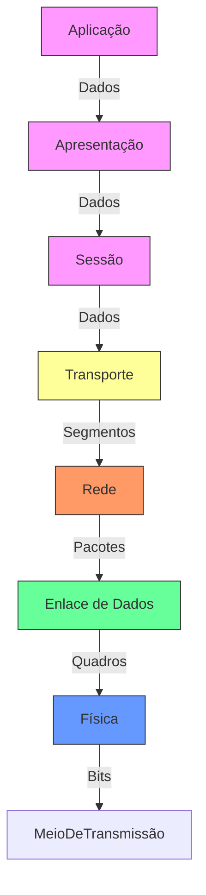

# Redes de Computadores 🛜

Disciplina ministrada pelo professor Claudio Souza Nunes

Lattes: http://lattes.cnpq.br/7682775885207598

## Aula 01

### Importância das Redes de Computadores

- Comunição entre pessoas
- Compartilhar recursos e troca de informações
- Parte essencial de nossa infraestrutura
- Aplicação em todos os setores
- Presença em todos os lugares

### Modelos de Rede

| Característica                     | LAN (Local Area Network)                                                                 | WAN (Wide Area Network)                                                                 | MAN (Metropolitan Area Network)                                                                 | PAN (Personal Area Network)                                                                 |
|-------------------------------------|------------------------------------------------------------------------------------------|-----------------------------------------------------------------------------------------|-------------------------------------------------------------------------------------------------|---------------------------------------------------------------------------------------------|
| Abrangência                         | Abrange menores distâncias (dentro de um prédio)                                         | Abrange maiores distâncias. Pode interconectar redes locais                             | Abrange uma cidade ou um campus universitário                                                   | Abrange distâncias muito curtas (geralmente até 10m)                                        |
| Velocidade dos Links de Comunicação | Mais rápidos                                                                            | Mais lentos                                                                            | Velocidade intermediária entre LAN e WAN                                                        | Mais lentos (geralmente)                                                                    |
| Objetivo Principal                  | Compartilhamento de recursos (impressoras, arquivos)                                     | Compartilhamento de informações entre grandes distâncias                                | Compartilhamento de recursos e informações em uma área metropolitana                            | Interligação de periféricos de uso pessoal (teclados, mouses)                               |
| Tipo de Topologia                   | Peer-to-peer ou servidores dedicados                                                     | Peer-to-peer                                                                           | Peer-to-peer ou servidores dedicados                                                            | Peer-to-peer                                                                                |
| Gestão das Informações              | Centralizadas                                                                           | Distribuídas                                                                           | Mista (pode ser centralizada ou distribuída)                                                    | Compartilhadas                                                                              |
| Exemplo de Uso                      | Redes empresariais ou domésticas                                                         | Internet                                                                               | Redes de grandes universidades ou empresas                                                      | Conexões Bluetooth, Wi-Fi entre dispositivos pessoais                                       |
| Custos de Implementação e Manutenção | Relativamente baixos                                                                    | Altos                                                                                  | Intermediários                                                                                  | Muito baixos                                                                                |
| Confiabilidade e Segurança          | Alta (em redes bem configuradas)                                                         | Variável (dependendo da infraestrutura)                                                | Alta (em redes bem configuradas)                                                                | Baixa (vulnerável a interferências e ataques próximos)                                       |
| Escalabilidade                      | Limitada                                                                                | Alta                                                                                   | Moderada                                                                                        | Muito limitada                                                                              |

### Modelo ISO/OSI
- É um modelo conceitual que padroniza as funções de um sistema em sete camadas distintas, sendo cada uma delas responsável por uma parte específica do processo de comunicação, facilitando a compreensão e o desenvolvimento de protocolos e tecnologias de rede. Garante que diferentes sistemas e redes possam se comunicar de forma eficiente e eficaz.

- Cada camada pega as informações passadas pela camada superior, acrescenta as informações pela qual ele é responsável e passa os dados para a camada inferior

* Mesma máquina -> camadas adjacentes
* Máquinas diferentes -> camadas correspondentes

| Camada         | Função Simplificada                                      | Exemplos de Serviços/Protocolos       | Exemplo Prático                     |
|----------------|---------------------------------------------------------|---------------------------------------|-------------------------------------|
| **Física**     | Transmite bits brutos (0s e 1s) por cabos, ondas, etc.  | Ethernet, USB, Bluetooth              | Conectar um cabo de rede ao PC       |
| **Enlace**     | Organiza os bits em "quadros" e controla erros locais   | Switches, Wi-Fi, Ethernet             | Switch ligando computadores numa LAN |
| **Rede**       | Define rotas e endereços lógicos (como um CEP)          | Roteadores, IP                        | Roteador enviando dados para outro país |
| **Transporte** | Garante entrega correta (como um correio confiável)     | TCP (confiável), UDP (rápido)         | Carregar um site sem erros           |
| **Sessão**     | Controla "conversas" entre apps (abre/fecha conexões)   | RPC, PAP                              | Manter login ativo no Netflix        |
| **Apresentação**| Traduz dados (criptografia, compressão, formatos)      | SSL/TLS, JPEG, MPEG                   | Cadeado no navegador (HTTPS)         |
| **Aplicação**  | Apps que você usa diretamente (navegador, e-mail, etc.) | HTTP, FTP, SMTP                       | Abrir o Gmail ou Facebook            |

### Topologia de rede
- É a disposição física ou lógica dos elementos (nós) em uma rede de comunicação. Ela define como os diferentes dispositivos estão interconectados e como os dados fluem entre esses dispositivos. As topologias de rede podem ser classificadas de rede podem ser classificadas de várias maneiras, incluindo **física** *(baseada na disposição real dos cabos e hardware)* e **lógica** *(baseada na forma como os dados são transferidos na rede, independentemente da disposição física)*

| Topologia | Descrição | Vantagens | Desvantagens |
|-----------|-----------|-----------|--------------|
| **Estrela** | Todos os dispositivos estão conectados a um dispositivo central (como um switch ou hub). | - Fácil de instalar e gerenciar - Problemas em um cabo não afetam o restante da rede | - Dependência do dispositivo central - Pode ser caro devido ao custo do hardware |
| **Barramento** | Todos os dispositivos estão conectados a um único cabo central (barramento). | - Econômica - Fácil de instalar para pequenas redes | - Difícil de diagnosticar problemas - Performance degrada com o aumento de dispositivos e tráfego |
| **Anel** | Cada dispositivo tem duas conexões, uma para cada dispositivo adjacente, formando um anel. | - Performance previsível - Sem colisões de dados | - Problemas em um dispositivo ou cabo afetam toda a rede - Difícil de expandir |
| **Malha** | Cada dispositivo está conectado a todos os outros dispositivos. | - Alta redundância e confiabilidade - Falhas não afetam a rede como um todo | - Complexa e cara para instalar e manter - Grande quantidade de cabos necessária |
| **Árvore** | Topologia hierárquica que combina características da estrela e do barramento com sub-redes organizadas em uma estrutura de árvore. | - Fácil de gerenciar e expandir - Problemas em uma sub-rede não afetam o resto da rede | - Dependência dos nós superiores - Pode ser difícil de configurar inicialmente |
| **Híbrida** | Combinação de duas ou mais topologias diferentes, adaptando-se às necessidades específicas da rede. | - Flexível e escalável - Pode otimizar as vantagens de diferentes topologias | - Pode ser complexa de configurar e gerenciar - Custo pode variar dependendo das topologias usadas |

## Aula 02

### Meios físicos de Transmissão - Conectividade Elétrica e Ótica

### Definição
- Constituem a base da camada física do modelo ISO/OSI, são responsável pela transmissão de sinais elétricos ou ópticos que transportam os dados brutos entre os dispositivos conectados à rede. A escolha do meio físico adequado influencia diretamente a qualidade da comunicação, a velocidade de transmissão e a confiabilidade da rede.

### Classificação dos Meios Físicos de Transmissão

#### Elétricos
- Trasmitem sinais na forma de pulsos elétricos
- Sujeitos a interferências eletromagnéticas, mas são amplamente utilizados devido ao seu custo acessível e à facilidade de instalação
- ex: Cabo coaxical e o cabo par trançado

#### Ópticos
- A fibra óptica transmite dados na forma de pulso de luz
-  Largura de banda muito maior e menor atenuação de sinal ao longo de longas distâncias
-  Ideal para conexão de alta velocidade e longas distâncias

### Cabo Coaxial

#### Estrutura
- Núcleo condutor central (geralmente de cobre)
- Camada de isolamento
- Malha de blindagem externa (proteção contra interferências eletromagnéticas)
- Capa de revestimento externo

#### Tipos

- Thicknet (10BASE5): Usado em backbones de redes antigas, com alta resistência a interferências e capacidade de transmissão em longas distâncias
- Thinnet (10BASE2): Mais finos e flexível que o Thicknet, facilitando a instalação em redes menores.

#### Conectores
- BNC: Mais comum, usado tanto em Thicknet quanto em Thinnet
- TNC e F-type: Conectores usados em aplicações específicas, como conexões de antenas.

#### Vantagens
- Baixo custo 
- Forte resistência à interferência
- Alta largura de banda
- Resistência física

#### Desvantagens
- Díficil de manusear
- Velocidade de transmissão limitada comparada com novas tecnologias

### Cabo Par Trançado

#### Estrutura
- Pares de fios de cobre trançados entre si (reduz a interferência eletromagnética e o crosstalk entre os pares.

#### Tipos
- UTP (Unshield Twisted Pair): Não possui blindagem, sendo mais barato e mais fácil de instalar, porém menos protegido contra interferências.
- STP (Shielded Twisted Pair): Inclui uma blindagem adicional que melhora a proteção contra interferência, sendo usado em ambientes com alta interferência eltromagnética.

#### Categorias

| Categoria | Velocidade Máxima | Uso Principal                          | Onde é Usado?                     |
|-----------|-------------------|----------------------------------------|-----------------------------------|
| **Cat 1** | 1 Mbps            | Voz (telefonia)                        | Linhas telefônicas antigas        |
| **Cat 2** | 4 Mbps            | Redes antigas (Token Ring)             | Sistemas obsoletos                |
| **Cat 3** | 10 Mbps           | Ethernet básica (10BASE-T)             | Redes antigas, telefonia          |
| **Cat 4** | 16 Mbps           | Redes Token Ring                       | Sistemas dos anos 90              |
| **Cat 5** | 100 Mbps          | Ethernet padrão (100BASE-TX)           | Redes domésticas/escritórios      |
| **Cat 5e**| 1 Gbps            | Ethernet Gigabit (1000BASE-T)          | Redes atuais (casas/empresas)     |
| **Cat 6** | 1 Gbps (10 Gbps*) | Ethernet Gigabit com menos interferência | Redes exigentes, cabos longos     |
| **Cat 6a**| 10 Gbps           | Ethernet 10 Gbps                       | Data centers, redes corporativas  |
| **Cat 7** | 10 Gbps           | Alta velocidade com blindagem          | Ambientes com muita interferência |
| **Cat 7a**| 10 Gbps           | Ultra velocidade (40 Gbps até 50m)     | Aplicações profissionais          |
| **Cat 8** | 40 Gbps           | Data centers de última geração         | Conexões curtas (até 30m)         |

> *Cat 6 suporta 10 Gbps até 55 metros.  
**Dica:** Para casas/escritórios, **Cat 5e** ou **Cat 6** são suficientes.  
**Profissional?** **Cat 6a+** para data centers ou redes 10G+.

#### Conectores
- RJ-45: Padrão em todos as categorias de UTP, compatível com a maioria sas aplicações de rede.
- GG45 e TERA: Usados em categorias superiores, como Cat7 e Cat8, para suportar maiores frequências e velocidades.

  
#### Vantagens e Desvantagens

| Aspecto              | Vantagens                                      | Desvantagens                                      |
|----------------------|-----------------------------------------------|--------------------------------------------------|
| **Custo**           | Mais barato que fibra óptica                 | Mais caro que soluções wireless em pequenas instalações |
| **Instalação**      | Fácil instalação e manuseio                 | Limitação de distância (sinal degrada com comprimento) |
| **Flexibilidade**   | Versátil para redes locais                  | Menos flexível para upgrades futuros vs fibra óptica |
| **Velocidade**      | Até 40 Gbps (Cat 8)                         | Inferior à fibra óptica                          |
| **Largura de Banda**| Suficiente para redes locais padrão         | Limitada vs fibra óptica                         |
| **Interferência**   | Blindados (STP) resistem a interferências   | Não blindados (UTP) são suscetíveis a ruídos     |
| **Durabilidade**    | Boa para ambientes internos                 | Menos resistente a danos físicos vs fibra        |
| **Compatibilidade** | Compatível com maioria dos equipamentos     | Pode exigir upgrades para categorias superiores  |
| **Manutenção**      | Fácil reparo                                | Desgaste natural (oxidação, conectores)          |
| **Distância**       | Ideal até 100m                              | Acima de 100m requer repetidores/switches        |

### Fibras Óticas

- A fibra óptica utiliza pulsos de luz para transmitir dados através de um núcleo de vidro ou plástico. Este núcleo é cercado por uma camada de revestimento que reflete a luz internamente, permitindo que os sinais de luz viajem longas distâncias com mínima perda de sinal

#### Tipos

##### Monomodo x Multimodo

| Aspecto                 | Fibra Óptica Monomodo                          | Fibra Óptica Multimodo                        |
|-------------------------|-----------------------------------------------|-----------------------------------------------|
| **Distância**           | Até 100 km (sem repetidor)                   | Até 2 km (sem repetidor)                     |
| **Largura de Banda**    | Alta (ideal para altas taxas de dados)       | Limitada (comparada à monomodo)              |
| **Custo**               | Alto (fibra + equipamentos laser)           | Econômico (fibra + transceptores VCSEL/LED)  |
| **Diâmetro do Núcleo**  | 9 µm (fino, menos dispersão)                | 50 µm ou 62.5 µm (maior dispersão modal)     |
| **Fonte de Luz**        | Laser (preciso e caro)                      | LED/VCSEL (mais barato)                      |
| **Aplicações**          | Telecomunicações, backbones de longa distância | LANs, data centers, sistemas locais         |
| **Instalação**          | Complexa (exige alta precisão)              | Fácil (núcleo largo tolera desalinhamentos) |
| **Desempenho**          | Superior (baixa atenuação, alta velocidade) | Adequado para curtas distâncias             |
| **Durabilidade**        | Alta (ambientes externos/longa distância)   | Boa (para ambientes internos/curtas distâncias) |
| **Upgrades Futuros**    | Flexível (suporta aumentos de capacidade)   | Limitado (restrições de largura de banda)    |

##### Conectores

| Conector | Descrição Resumida | Aplicações Principais |
|----------|--------------------|-----------------------|
| **SC**   | Conector push-pull de 2,5 mm, fácil manuseio | Data centers, telecomunicações |
| **LC**   | Compacto (ferrule 1,25 mm), alta densidade | Redes densas, data centers |
| **ST**   | Conector de bayoneta (2,5 mm), antigo | Redes multimodo antigas |
| **FC**   | Com rosca, robusto | Telecomunicações de longa distância |
| **SMA**  | Rosca antiga, industrial | Aplicações militares/industriais |
| **E2000**| Tampa automática | Redes de alta performance |
| **M**    | Multifibras (alta densidade) | Data centers, telecom |
| **DN**   | Rosca redonda, estável | Redes robustas |
| **MT-RJ**| Compacto (2 fibras, estilo RJ45) | Alta densidade |
| **MPO**  | Multifibras (12-72 fibras) | Data centers, 40G/100G |
| **D4**   | Com rosca (2 mm), obsoleto | Redes antigas |
| **Biconic** | Cônico, histórico | Sistemas antigos |

##### Vantagens x Desvantagens
| Vantagens                          | Desvantagens                          |
|------------------------------------|---------------------------------------|
| ✅ Alta largura de banda (100Gbps+) | ❌ Alto custo inicial                 |
| ✅ Longas distâncias (100km+)       | ❌ Fragilidade física                 |
| ✅ Imunidade a interferências       | ❌ Reparos complexos                  |
| ✅ Alta segurança                   | ❌ Requer conversores óptico-elétricos|
| ✅ Sustentável (baixo consumo)      | ❌ Impacto ambiental na fabricação    |

### Resumo Geral 

| Aspecto                | Fibra Óptica                     | Par Trançado                     | Cabo Coaxial                     |
|------------------------|----------------------------------|----------------------------------|----------------------------------|
| **Custo**             | Alto (instalação + equipamentos) | Baixo                            | Moderado                         |
| **Largura de Banda**  | Centenas de Gbps                 | Até 10 Gbps (Cat6a/7)           | Até 10 Gbps (curtas distâncias)  |
| **Distância**         | Até 100 km                       | Até 100m (Cat6)                  | Até 500m                         |
| **Interferência**     | Imune                            | Suscetível (exceto STP)          | Boa resistência                  |
| **Segurança**         | Alta (dificil de interceptar)    | Baixa                            | Moderada                         |
| **Instalação**        | Complexa (cuidado com fragilidade)| Fácil                            | Moderadamente difícil            |
| **Manutenção**        | Caro (equipamentos especializados)| Barato                          | Moderado                         |
| **Aplicações**        | WANs, data centers               | LANs, telefonia                  | TV cabo, redes locais            |
| **Durabilidade**      | Alta (exceto flexões)            | Moderada                         | Alta                             |

| Necessidade               | Melhor Opção          | Por quê?                          |
|---------------------------|-----------------------|-----------------------------------|
| Orçamento limitado        | Par Trançado          | Custo baixo, fácil instalação     |
| Alta velocidade/longas distâncias | Fibra Óptica   | Largura de banda e alcance        |
| Resistência a interferência | Cabo Coaxial       | Blindagem eficiente               |
| Upgrades futuros          | Fibra Óptica          | Escalabilidade sem troca de cabos |

